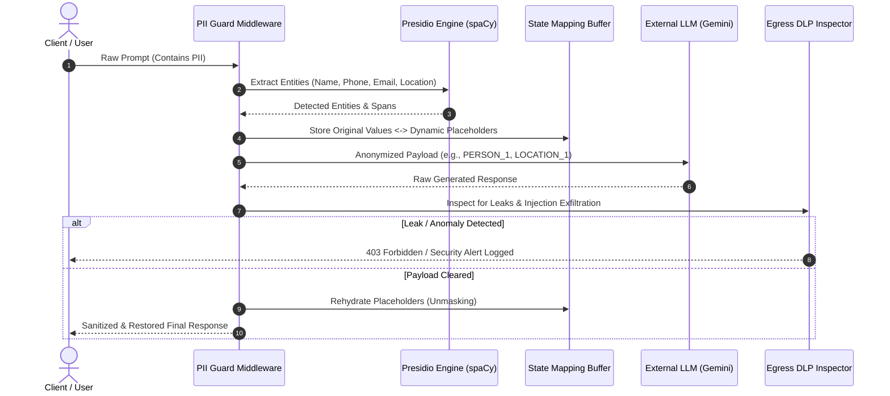

# 🛡️ Zero-Trust PII Guard Middleware for LLMs

[](https://www.python.org/)
[](https://fastapi.tiangolo.com/)
[](https://github.com/microsoft/presidio)
[](https://opensource.org/licenses/MIT)
[](https://docs.pytest.org/)

A dual-layer, high-reliability security proxy positioned between client applications and Large Language Models (LLMs). Operating under **Zero-Trust** and **Data Minimization** principles, it prevents enterprise data leakage, stops PII exfiltration, and intercepts prompt-injection extraction attempts in real time.

---

## 🏗️ Architecture & Data Pipeline

The proxy intercepts requests at both **Ingress (Pre-LLM)** and **Egress (Post-LLM)** phases, ensuring unencrypted sensitive entities never leave the application boundary.



---

## ⚡ Core Engineering Features

* 🔒 **Dynamic Ingress Anonymization:** Uses Microsoft Presidio and spaCy NER engines to detect sensitive entities (Names, Phone Numbers, Emails, Locations) and map them to dynamic tokens (`<PERSON_1>`, `<EMAIL_ADDRESS_1>`).
* 🧠 **Stateful Bi-Directional Mapping:** Resolves index-shifting issues via structured reverse sorting, ensuring deterministic restoration across complex prompt structures.
* 🚨 **Post-Inference DLP Inspection:** Inspects model completions before delivery. If prompt injection or model hallucination leaks sensitive context, the request is intercepted.
* 📜 **Security Audit Logging:** Cryptic audit traces and latency telemetry are recorded in `logs/security_audit.log` for SIEM integration.

---

## 🛠️ Tech Stack

* **Runtime:** Python 3.10+
* **Framework:** FastAPI, Uvicorn, Pydantic
* **NLP & Privacy Engines:** Microsoft Presidio Analyzer & Anonymizer, spaCy
* **Integration:** Google Gemini API
* **Quality Assurance:** Pytest

---

## 🚀 Quickstart & Local Setup

### 1. Clone & Dependencies
```bash
git clone https://github.com/mfurkanerkan15/pii-guard-middleware.git
cd pii-guard-middleware

python -m venv venv
.\venv\Scripts\activate  # On Linux/macOS: source venv/bin/activate
pip install -r requirements.txt
python -m spacy download en_core_web_lg
```

### 2. Environment Variables
Copy `.env.example` to `.env` and set your credentials:
```bash
cp .env.example .env
```
Inside `.env`:
```env
GEMINI_API_KEY=your_gemini_api_key_here
```

### 3. Run the Middleware
```bash
python -m uvicorn main:app --reload
```
Interactive API docs: **`[http://127.0.0.1:8000/docs](http://127.0.0.1:8000/docs)`**

---

## 🧪 Automated Testing

Run the integration and unit test suite:
```bash
pytest -v
```